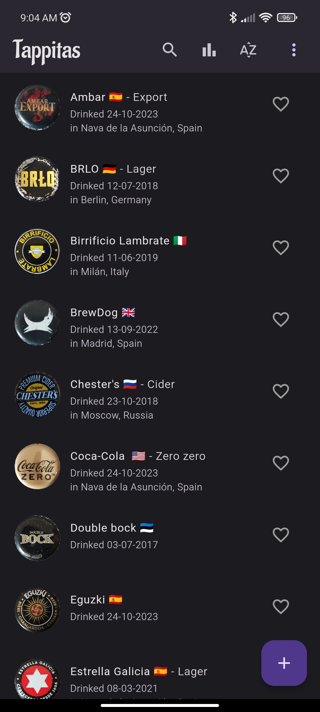
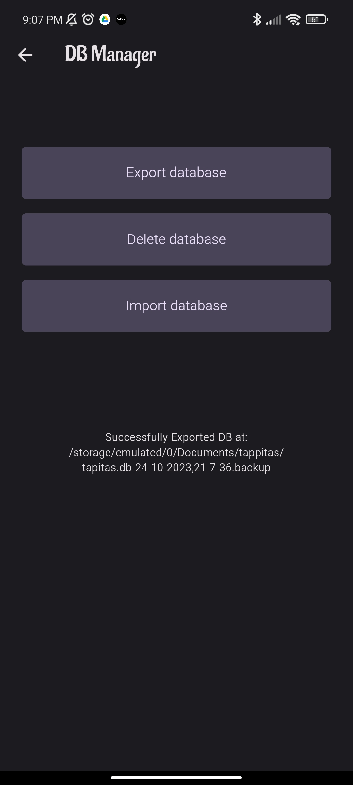
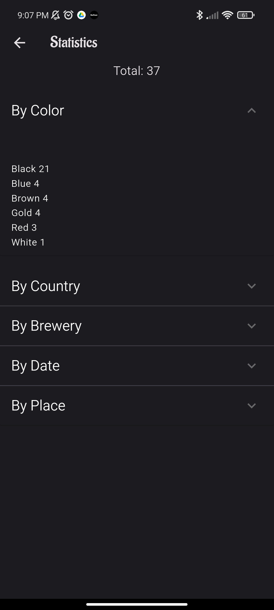
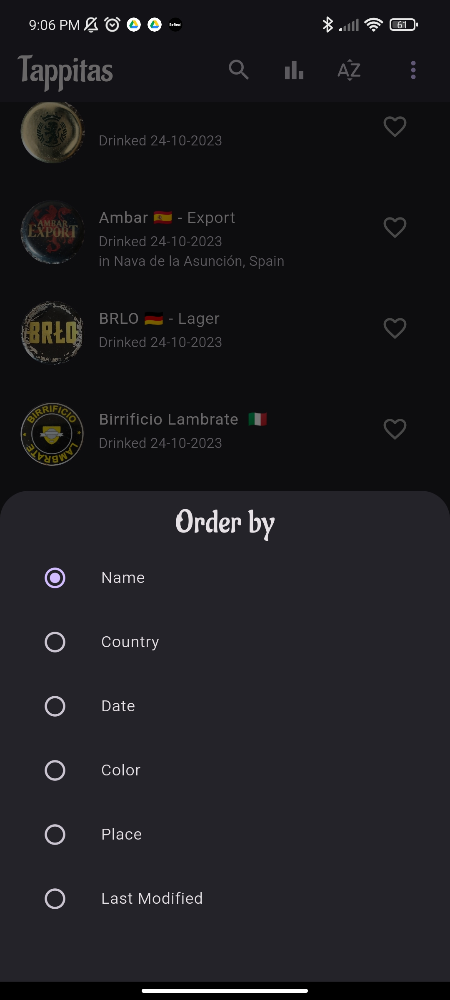
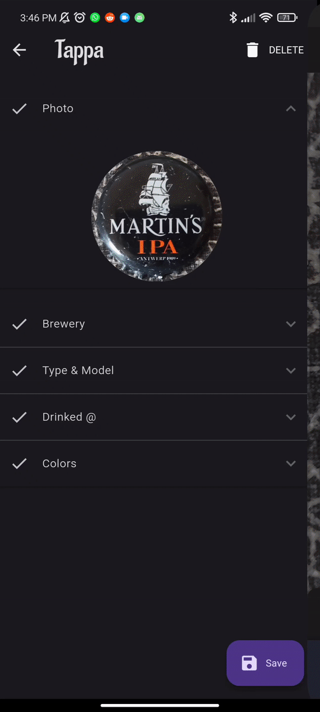
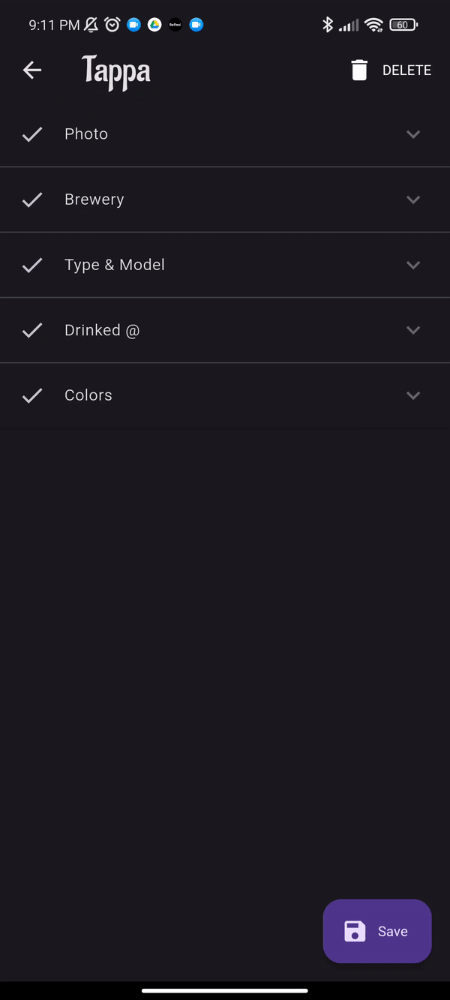
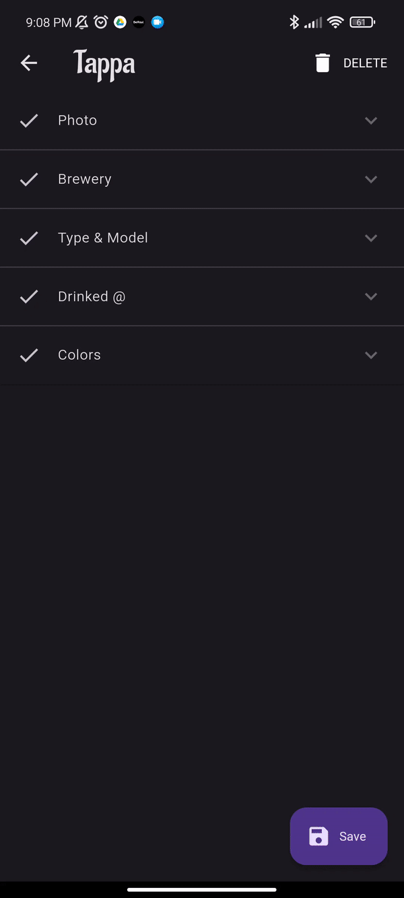

# T*app*itas

**Tappitas** is an Android app to manage a collection of beer caps (or whatever drink who use a cap). 
The name comes from Latin American Spanish, where a cap is called *tapita*. The idea to make this project comes from my desire of manage [my collection of caps](https://www.instagram.com/p/Cv7x6cFrzBr/?img_index=1).

## Getting Started

- Download the [apk](https://drive.google.com/file/d/15e-zteLUPEWXlkxvFcpomaCJ3ViL9m8x/view?usp=share_link)

## Screenshots

### Main screen
- This is the main screen, where a list of tappas is loaded

## Features

### Backups
- Tappitas uses a local sqlite database, with the posibility of make backups and restore them
  

### Statistics
- To know how much caps you have, and sort by their own characteristics (color, brewery, brewery country, date, place, etc.)
  

### Sort
- You can sort the list of tappas

### Add/Edit a tappa

 - Photo: Use of image picker & image cropper to take a pic (or upload from gallery) of the cap and crop to fit in a circle

 - Brewery: You can search the country of the brewery in google with the search feature

 - Type: You have a list of the most common types of beer

 - Date & Place: Use of a date picker to pick a date, and use of a localizator feature to pick the place you are right now, if you are drinking the beer now

 - Colors: You can pick the primary and secondary color of the cap easily from a dialog

## to-do

- [ ] Translations
- [X] Backup database
- [ ] Use bloc pattern
